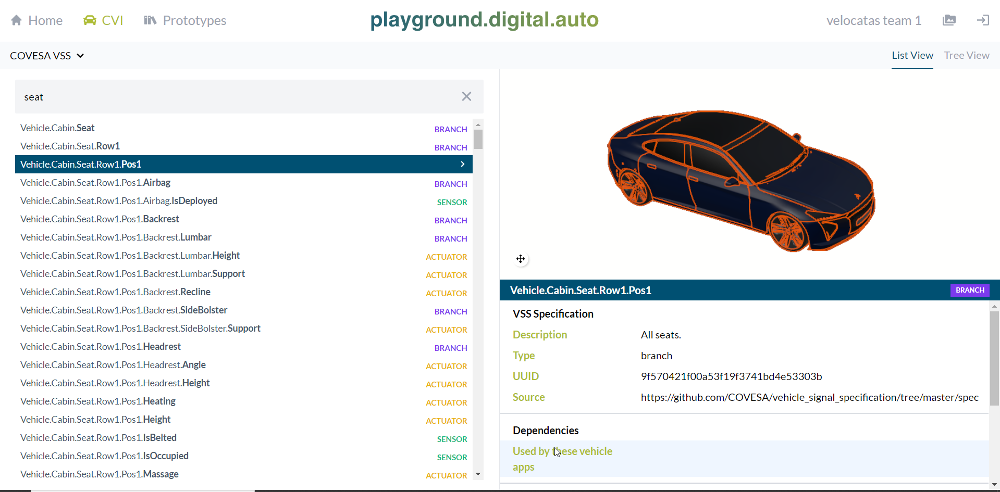
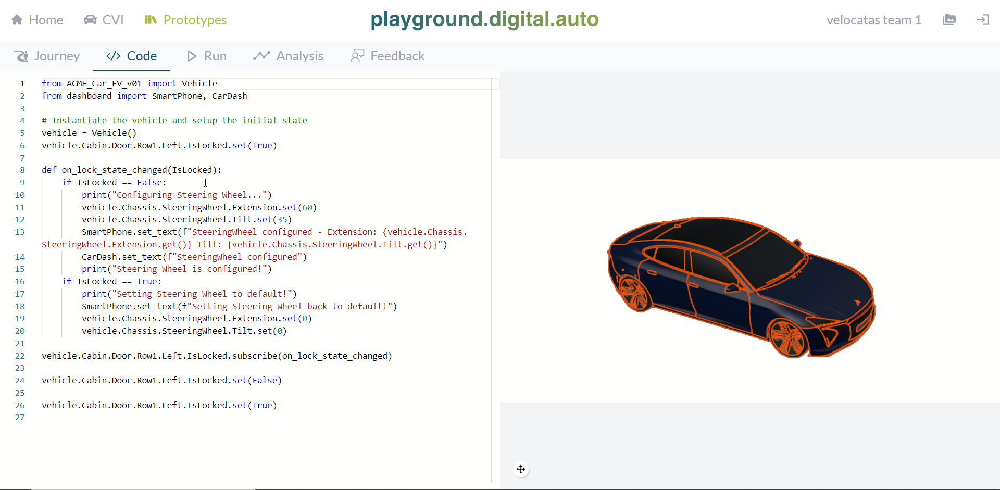
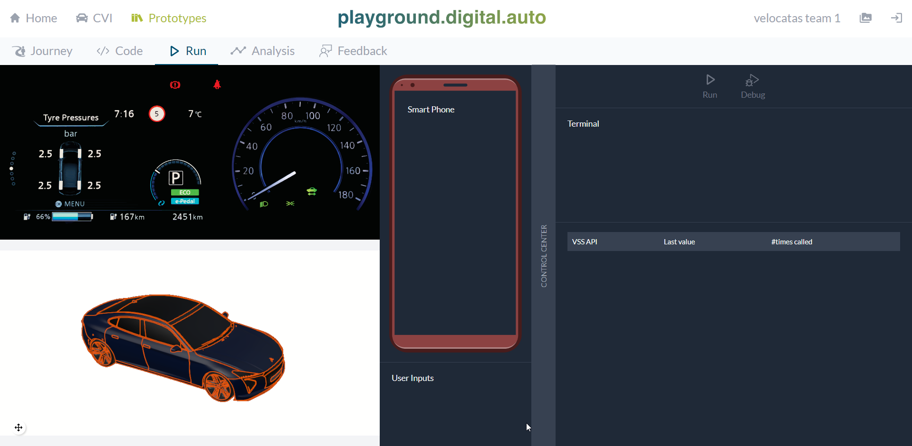

# Hack Challenge 'Passenger Welcome'

Tutorial Available also at [Velocitas Documentation](https://websites.eclipseprojects.io/velocitas/docs/tutorials/prototyping/).

The open and web based [Playground](http://playground.digital.auto) of _digital.auto_ offers a rapid prototyping environment to explore and validate ideas of a vehicle app which interact with the different vehicle sensors and actuators via standardized APIs specified by the COVESA [Vehicle Signal Specification (VSS)](https://covesa.github.io/vehicle_signal_specification/introduction/) without custom setup requirements. It provides the opportunity:

- To browse, navigate and enhance the vehicle signals (sensors, actuators and branches) in the _Vehicle API Catalogue_ mapped to a 3D model of the vehicle
- To build vehicle app prototypes in the browser using Python and the _Vehicle API Catalogue_
- To test the vehicle app prototype a dashboard in the browser with 3D animation for API calls
- To create new plugins, which usually represent UX widgets or remote server communication to enhance the vehicle mockup experience in the playground
- To collect and evaluate user feedback to prioritize your development portfolio

A short video to see the playground in action can be found [here](https://drive.google.com/file/d/1qYfakx6E592PWBtPzAc_m_LrmBsvaI9K/view?usp=share_link)

## Passenger Welcome Use Case
The basic idea of this use case is to implement an SdV-controlled sequence of steps to welcome the passenger, once his proximity to the vehicle has been detected. The proximity detection itself is currently not in scope.

||

Our use case starts once the proximity of the passenger has been detected. In this case, the vehicle can perform a number of steps, including:
- Automatically open the door
- Play a sequence of differents ambient lights
- Adjust the seat to the preferences of the passenger

Of course there are no limitations to the creativity here to add additional elements to the welcome sequence.
A first SdV prototype of the welcome sequence is available in the BCX playground envionment.
Please have a look at this [video](https://drive.google.com/file/d/1zLexIQDM5UIkn85QjysGiD-SaK7cwSbG/view?usp=share_link) to learn more about the BCX setup we have prepared for you in the playground.

||

## Step 1 - Prototype your idea of the 'Passenger Welcome' functionality

As first step open [digital.auto.playground](https://bcx.digital.auto/) select [_Get Started_](https://bcx.digital.auto/model) in the Prototyping section of the landing page and select the Vehicle Model of your team.

> **_NOTE:_**  If you do not have an own Vehicle Model assigned to your team please contact the Velocitas Hack Coaches. It is important that each team uses their own Vehicle Model and with that their own prototype instance, otherwise you would override the changes of the other teams.

Now you have the option to check the existing vehicle signals by selecting the _Vehicle APIs_ and validate if the required signals for your interpretation of the 'Passenger Welcome' functionality exist and how they are named.

The next step would be to prototype your idea. To do so:

- Click on _Prototypes_ (in the top right toolbar),
- Create a new prototype, by clicking on _New Prototype_ and filling out the informations,
- Click on the _Open_ button (right side),
- Go to the _Code_ section and
- Start your prototype right away.

To test your prototype go to the _Run_ section, which opens a dashboard consisting all vehicle and application components similar to mockups. The control center on the right side has an integrated terminal showing all of your prototyped outputs as well as a list of all called VSS API's. The _Run_ button executes all your prototype code from top to button. The _Debug_ button allows you to step through your prototype line for line.

To get started quickly, the digital.auto team has added a number of widgets to simulate related elements of the vehicle – like doors, seats, light, etc. – and made them available in the playground.

## Step 2 (optional) - add custom plugins for advanced prototypes
You might  have additional ideas for vehicle features which you would like to add to your prototype, e.g. an antenna waving a warm “welcome”…. If you need additinal plugins to support this, you can add them on your own. Check out [this video](https://drive.google.com/file/d/1Z-tv5COhmX-lQGtHMSUZWLuvv5PoFAFR/view?usp=share_link) which is explaining how to develop plugins. Additional documentation can be found on the developer [documentation pages] (https://www.digitalplaybook.org/index.php?title=Documentation:_playground.digital.auto).

||

**Next step:** [Transfer your prototype into a working application](/docs/step-2-generating.md)
