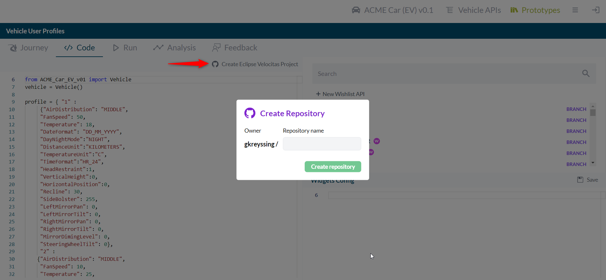

# Hack Challenge 'Passenger Welcome'

In the previous step you started with envision and prototyping your vehicle app that implements the 'Passenger Welcome' functionality. You tested the signals against mocked vehicle components. Now it's time to transfer it into your Development Environment and test it with real vehicle services. Here [Eclipse Velocitas](https://websites.eclipseprojects.io/velocitas/) comes into the game. We are providing a project generator that allows you to generate a Vehicle Application GitHub repository from your previously created prototype code based on our [vehicle-app-python-template](https://github.com/eclipse-velocitas/vehicle-app-python-template).

## Step 2 - Transfer your prototype into a vehicle application

In the 'Code' section of your prototype in the [digital.auto.playground](https://digitalauto.netlify.app/) you have the Button 'Create Eclipse Velocitas Project'.
If you press this button you will be forwarded to [GitHub](https://github.com/) to login with your GitHub Account and authorize _velocitas-project-generator_ to create the repository for you. After you authorized the project generator you will be redirected to the [digital.auto.playground](https://digitalauto.netlify.app/) and asked for a repository name (Which also is the app's name). After pressing "Create repository" the project generator takes over your prototype code, adapts it to the structure in the [vehicle-app-python-template](https://github.com/eclipse-velocitas/vehicle-app-python-template) and creates a new private repository under your GitHub User.



If you would like to know what exactly the generator is doing, please have a look on the code: [velocitas-project-generator-npm](https://github.com/eclipse-velocitas/velocitas-project-generator-npm). Feedback is welcome :)

After the generation of the repository is completed a pop-up dialog with your repository URL will be displayed. The newly created repository will contain:

- _/app/src/main.py_ containing your modified prototype code
- _/app/AppManifest.json_ with definition of required services
- _/app/requirements.txt_ with definition of requirements
- _/.devcontainer_/ required scripts to install every prerequisites in Microsoft Visual Studio Code
- _/.github/workflows/_ with all required CI/CD pipelines to build, test and deploy the vehicle application as container image to the GitHub container registry

Your vehicle application transfered now to a GitHub repository and is ready to be extended. Clone your new repository and start it with Microsoft Visual Studio Code. Detailed information you can find here: [Velocitas documentation - Starting development environment](https://websites.eclipseprojects.io/velocitas/docs/tutorials/quickstart/#starting-development-environment)

### Sharpen your generated Repository

**CodeQL Analysis**

By default the template repository comes with automated CodeQL Analysis to automatically detect common vulnerabilities and coding errors. It is available if you have a [GitHub advanced security](https://docs.github.com/en/get-started/learning-about-github/about-github-advanced-security) license in your org or if your repository is public. To change visibility: Go to your repository settings -> General -> Danger Zone (at the bottom) -> Change repository visibility -> Change visibility to public.

---

**Disable Linters in CI**

[playground.digital.auto](https://digitalauto.netlify.app/) does not include automated code formatting/linting.\
To avoid failing CI workflows due to linting errors in your new repository the `Run Linters` CI step is disabled by default.
You can enable it by changing false -> true in the `./.github/workflows/ci.yml` file

```yaml
- name: Run Linters
  if: ${{ false }}
  uses: ./.github/actions/pre-commit-action
```

---

**Manual Adaptions**

Since the project-generator identifies typical python syntax and patterns out of the prototype there could be several cases where manual code adaptions cannot be excluded.\
Most of the prototype code is extracted into the `on_start`-method of velocitas.

- Prototyped local variables which need to be accessed e.g. in callback methods need to be global (move them out above the VehicleApp class).
- Depending on how using variables in a Print/Logging statement is implemented, statements need to be adapted in Velocitas.
- Have in mind that Velocitas uses the standard [VSS](https://covesa.github.io/vehicle_signal_specification/) model. If you use custom signals in your prototype, you have to find similar standard signals to use in Velocitas.
- Programmatically used plugins (plugins.\*) in your prototype are not supported in Velocitas.

If you have any additional findings, please do not hesitate to approach one of our coaches.

---

Depending on your ideated functionality for the 'Welcome Passenger' in the next step you could e.g.:

- Add cloud connectivity to trigger your applictaion or to provide information to the cloud
- Integrate a vehicle service that execute the request on vehicle side

**Next step:** [Extend the your use case with the component you need for you use case](/docs/step-3-extending.md)
